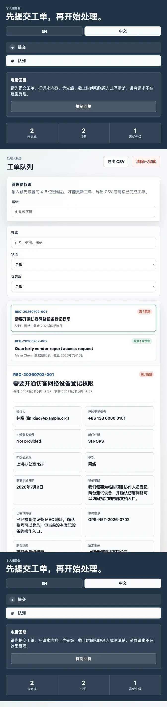

# ticket-back

> If they make you fill forms, they can fill forms too.

`ticket-back` is a personal request desk for reversing one small unfairness of modern life: organizations often require people to submit forms, open tickets, verify identity, choose categories, and wait. But when those same organizations want something from a person, they may call directly, interrupt immediately, and provide little context.

This project gives you a calm boundary:

> Please submit a ticket first.

It is not about being rude. It is about making the relationship more equal.



## 中文

> 如果他们要求你填表，他们也可以填表。

`ticket-back` 是一个个人工单系统，用来抵消一种很常见的不公平：公司、政府部门、学校、平台、房东或其他组织，常常要求个人填表、提交工单、验证身份、选择类别，然后等待处理。

但当这些组织反过来向个人提出要求时，却可能直接打电话、立即打断、不给清晰背景，也不给工单编号。

这个项目提供一个平静的边界：

> 请先提交工单。

这不是为了无礼，而是为了让关系更平等。

## Features

- Chinese-first bilingual intake interface
- Configurable intake strictness with `easy`, `middle`, and `hard` modes
- Ticket queue with status tracking, owner notes, and CSV export
- Admin passcode protection for ticket operations and exports
- Configurable site text, categories, priorities, validation rules, ad placeholder, and emergency keywords
- Spam and abuse reduction with honeypot fields, request size limits, rate limits, private file blocking, and emergency keyword rejection

## Strictness modes

| Mode | Verification | Required organization data | Best for |
| --- | --- | --- | --- |
| `easy` | No challenge code, no verification confirmation, no phone/internal reference/department requirement | None | Friendly personal intake, low-friction demos, trusted requesters |
| `middle` | Phone, internal reference ID, department code, verification code, and confirmation checkbox | None | Normal personal request desk use where requesters should provide traceable context |
| `hard` | Phone, department code, verification code, and confirmation checkbox | Legal entity name, registration number, tax ID, certificate authority, public certificate/registry link, authorized representative, and authorization reference | Organization-facing requests where the requester should provide public business credentials first |

## Privacy note

Do not use this project to collect government IDs, private certificates, passwords, or sensitive personal information unless you have a lawful basis, clear notice, appropriate consent where required, secure storage, limited retention, and a way for people to request deletion. Hard mode is intended for public organization credentials, not personal identity documents.

## 隐私提示

除非你有合法依据、清晰告知、必要同意、安全存储、有限留存，以及删除请求机制，否则不要用本项目收集政府身份证件、非公开证书、密码或敏感个人信息。困难模式的目标是收集公开的公司/机构凭证，而不是个人身份证明文件。

## Run

```bash
python3 server.py --host 127.0.0.1 --port 8000
```

Open `http://127.0.0.1:8000/`.

To allow other devices on your local network:

```bash
python3 server.py --host 0.0.0.0 --port 8000
```

## Configure

Edit `site_config.json` to customize:

- strictness level
- site title and text
- categories and priorities
- ad placeholder content
- admin passcode
- validation limits
- rate limits
- emergency keywords

Runtime tickets are stored in `tickets.json`, which is ignored by git.

Admin actions use the 4-8 character `admin.passcode` value in `site_config.json`. Change the demo passcode before sharing or deploying the app.
